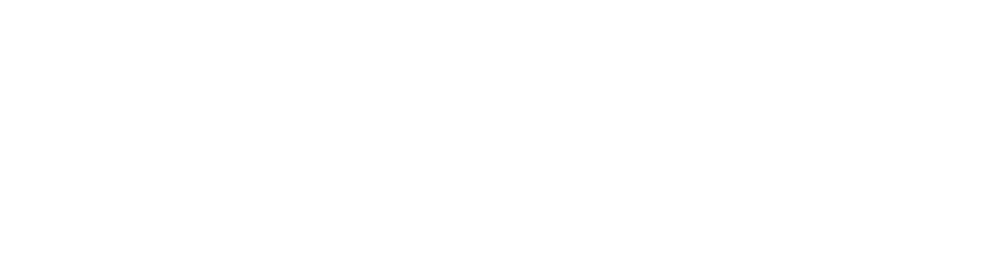
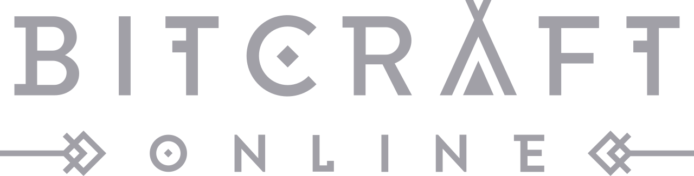
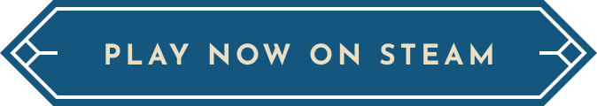

    
    

    

    <a href="https://twitter.com/BitCraftOnline" target="_blank" rel="noopener noreferrer" aria-label="Visit our Twitter">
        <svg xmlns="http://www.w3.org/2000/svg" width="48" height="49" viewBox="0 0 48 49" fill="none">
            <path d="M27.4284 21.9562L40.8324 6.71094H37.6572L26.0136 19.9455L16.7208 6.71094H6L20.0556 26.7259L6 42.7109H9.1752L21.4632 28.7318L31.2792 42.7109H42M10.3212 9.05379H15.1992L37.6548 40.4832H32.7756" fill="#b6b6b6"></path>
        </svg>
    </a>
    &nbsp;
    <a href="https://discord.com/invite/bitcraft" target="_blank" rel="noopener noreferrer" aria-label="Visit our Discord">
        <svg xmlns="http://www.w3.org/2000/svg" width="48" height="49" viewBox="0 0 48 49" fill="none">
            <path fill-rule="evenodd" clip-rule="evenodd" d="M28.1141 12.64C25.3933 12.2248 22.6065 12.2248 19.8856 12.64C19.6396 12.0495 19.277 11.329 18.9586 10.7659C18.9026 10.6692 18.7535 10.726 18.6636 10.7433C17.2746 11.0271 11.824 12.433 11.4672 13.0234C7.52912 18.9068 6.00375 24.6665 6.00002 30.3572C5.99889 31.3355 6.04453 32.3129 6.12843 33.2881C6.15181 33.5457 6.1027 33.528 6.30334 33.6737C9.34349 35.8883 12.2905 37.2401 15.1838 38.1389C15.2303 38.1532 15.2805 38.1367 15.3096 38.0973C16.0024 37.1524 16.6193 36.1555 17.1488 35.107C17.1802 35.0454 17.15 34.973 17.0869 34.9482C16.1073 34.5765 15.1755 34.124 14.2787 33.6095C14.2076 33.5687 14.2019 33.4677 14.267 33.4186C14.4562 33.2776 14.645 33.1306 14.8245 32.9809C14.8573 32.954 14.9027 32.9484 14.9413 32.9662C20.8036 35.6436 27.1966 35.6436 33.0587 32.9662C33.0973 32.9484 33.1424 32.954 33.1754 32.9809C33.355 33.1306 33.5437 33.2776 33.7329 33.4186C33.7979 33.4677 33.7923 33.5687 33.7211 33.6095C32.8245 34.124 31.8926 34.5765 30.9131 34.9482C30.8502 34.973 30.8198 35.0454 30.851 35.107C31.3807 36.1555 31.9976 37.1524 32.6904 38.0973C32.7195 38.1368 32.7698 38.1532 32.8162 38.1389C35.7093 37.2401 38.6566 35.8883 41.6968 33.6737C41.8972 33.528 41.8482 33.5457 41.8716 33.2881C41.9553 32.3129 42.0009 31.3355 42 30.3572C41.9961 24.6665 40.4708 18.9068 36.5327 13.0234C36.1761 12.433 30.7252 11.0271 29.3362 10.7433C29.2464 10.726 29.0972 10.6692 29.0412 10.7659C28.7228 11.329 28.3601 12.0495 28.1141 12.64ZM29.9717 29.4219C31.7456 29.4219 33.2066 27.7943 33.2066 25.794C33.2066 23.7941 31.7738 22.166 29.9717 22.166C28.1549 22.166 26.7077 23.8093 26.7372 25.794C26.7372 27.7943 28.1701 29.4219 29.9717 29.4219ZM18.0281 29.4219C16.2543 29.4219 14.7931 27.7943 14.7931 25.794C14.7931 23.7941 16.2263 22.166 18.0281 22.166C19.8448 22.166 21.292 23.8093 21.263 25.794C21.263 27.7943 19.8296 29.4219 18.0281 29.4219Z" fill="#b6b6b6"></path>
        </svg>
    </a>
    &nbsp;
    <a href="https://www.facebook.com/BitCraftOnline" target="_blank" rel="noopener noreferrer" aria-label="Visit our Facebook">
        <svg xmlns="http://www.w3.org/2000/svg" width="48" height="49" viewBox="0 0 48 49" fill="none">
            <path fill-rule="evenodd" clip-rule="evenodd" d="M6 25.7109C6 34.6109 12.5 42.0109 21 43.5109L21.1003 43.4307C21.0669 43.4242 21.0334 43.4176 21 43.4109V30.7109H16.5V25.7109H21V21.7109C21 17.2109 23.9 14.7109 28 14.7109C29.3 14.7109 30.7 14.9109 32 15.1109V19.7109H29.7C27.5 19.7109 27 20.8109 27 22.2109V25.7109H31.8L31 30.7109H27V43.4109C26.9666 43.4176 26.9331 43.4242 26.8997 43.4307L27 43.5109C35.5 42.0109 42 34.6109 42 25.7109C42 15.8109 33.9 7.71094 24 7.71094C14.1 7.71094 6 15.8109 6 25.7109Z" fill="#b6b6b6"></path>
        </svg>
    </a>
    &nbsp;
    <a href="https://www.instagram.com/bitcraftonline/" target="_blank" rel="noopener noreferrer" aria-label="Visit our Instagram">
        <svg fill="#b6b6b6" width="48px" height="49px" viewBox="0 0 1024 1024" xmlns="http://www.w3.org/2000/svg" stroke="#b6b6b6">
            <path d="M512 306.9c-113.5 0-205.1 91.6-205.1 205.1S398.5 717.1 512 717.1 717.1 625.5 717.1 512 625.5 306.9 512 306.9zm0 338.4c-73.4 0-133.3-59.9-133.3-133.3S438.6 378.7 512 378.7 645.3 438.6 645.3 512 585.4 645.3 512 645.3zm213.5-394.6c-26.5 0-47.9 21.4-47.9 47.9s21.4 47.9 47.9 47.9 47.9-21.3 47.9-47.9a47.84 47.84 0 0 0-47.9-47.9zM911.8 512c0-55.2.5-109.9-2.6-165-3.1-64-17.7-120.8-64.5-167.6-46.9-46.9-103.6-61.4-167.6-64.5-55.2-3.1-109.9-2.6-165-2.6-55.2 0-109.9-.5-165 2.6-64 3.1-120.8 17.7-167.6 64.5C132.6 226.3 118.1 283 115 347c-3.1 55.2-2.6 109.9-2.6 165s-.5 109.9 2.6 165c3.1 64 17.7 120.8 64.5 167.6 46.9 46.9 103.6 61.4 167.6 64.5 55.2 3.1 109.9 2.6 165 2.6 55.2 0 109.9.5 165-2.6 64-3.1 120.8-17.7 167.6-64.5 46.9-46.9 61.4-103.6 64.5-167.6 3.2-55.1 2.6-109.8 2.6-165zm-88 235.8c-7.3 18.2-16.1 31.8-30.2 45.8-14.1 14.1-27.6 22.9-45.8 30.2C695.2 844.7 570.3 840 512 840c-58.3 0-183.3 4.7-235.9-16.1-18.2-7.3-31.8-16.1-45.8-30.2-14.1-14.1-22.9-27.6-30.2-45.8C179.3 695.2 184 570.3 184 512c0-58.3-4.7-183.3 16.1-235.9 7.3-18.2 16.1-31.8 30.2-45.8s27.6-22.9 45.8-30.2C328.7 179.3 453.7 184 512 184s183.3-4.7 235.9 16.1c18.2 7.3 31.8 16.1 45.8 30.2 14.1 14.1 22.9 27.6 30.2 45.8C844.7 328.7 840 453.7 840 512c0 58.3 4.7 183.2-16.2 235.8z"></path>
        </svg>
    </a>

# BitCraftPublic

This repository contains the **server-side code** for **BitCraft**, a community sandbox MMORPG developed by Clockwork Labs.

BitCraft blends cooperative gameplay, city-building, crafting, exploration, and survival — all in a single seamless world shared by players around the globe.
This repository represents the first phase of our open source initiative. It is being made available for public inspection, experimentation, and contribution.

In this first phase we are only open sourcing the server side code.

## About BitCraft

BitCraft is a community-driven MMORPG where players collaborate to shape a procedurally generated world. There are no fixed classes or roles — instead, players build, craft, explore, trade,
and govern together to shape their civilizations.

- Game website: [https://bitcraftonline.com](https://bitcraftonline.com)  
- Steam page: [https://store.steampowered.com/app/1874960/BitCraft](https://store.steampowered.com/app/1874960/BitCraft)

## About This Repository

This repository contains the code for running a BitCraft server. It includes game logic, state management, and server-side systems, but does not include the client or tools required to connect to the official game.

The server is built using [SpacetimeDB](https://spacetimedb.com), a real-time, reactive database designed for multiplayer game development.
The BitCraft server is structured as a SpacetimeDB module, all the data is stored in spacetimeDB `tables` and all the logic runs inside `reducers`.
If you're interested in exploring the server or trying to run a minimal version locally, start with the spacetimeDB documentation:

- [SpacetimeDB Docs](https://spacetimedb.com/docs)

## Contributing

We welcome contributions that improve correctness, stability, or player experience.

Please see [CONTRIBUTING.md](./CONTRIBUTING.md) for details on contribution scope and process.

## License

See [LICENSE](./LICENSE) for license details. The license applies only to the contents of this repository. It doesn't extend to any other assets or code that is not part of BitCraftPublic.

## What you can and cannot do

To avoid any confusion, here is a clear summary what is allowed and what is not allowed:

You can:
- Read and study the code to better understand how the game works
- Modify and experiment with the code locally
- Run your own servers for experimentation
- Use it as a reference for building your own projects
- Make a game similar to BitCraft with your own IP (art and themes) using our code as a basis

You cannot:
- Use BitCraft’s art, game content, music, or other protected assets
- Use BitCraft’s IP or present forks as official
- Share information about any discovered exploits in the game with anyone other than us
- Operate official, unofficial, private or any otherwise competing BitCraft servers
- Do anything that violates the open source license

The game’s assets and IP remain protected, and the official BitCraft servers will continue to be operated by us.

This repository is released as part of our commitment to openness and long-term collaboration with the community. It is not connected to the live game infrastructure, and any changes here will not affect the official BitCraft servers.
